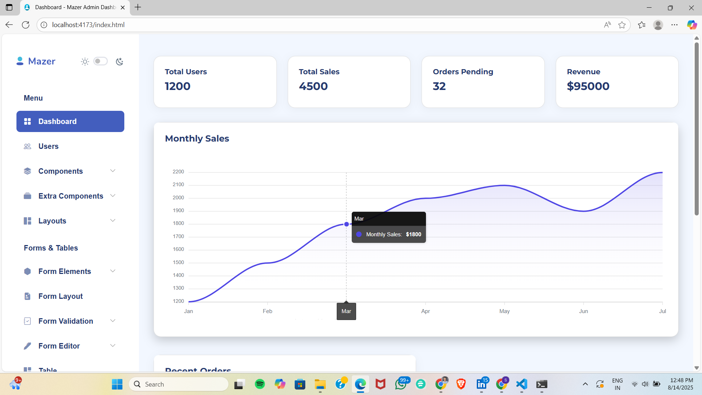
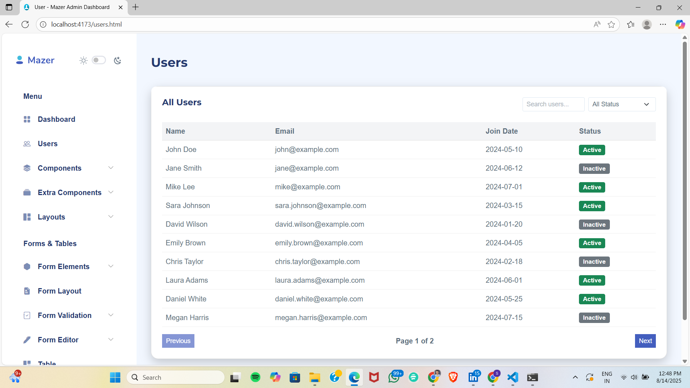

# Mazer Custom

Customized Mazer dashboard with new data views and user information enhancements.

---

## ✅ Changes Made

1. **Created a new dashboard for new data**  
   - Added a dedicated dashboard page/view to visualize the latest dataset.
   - Updated components and layout to accommodate the new metrics and charts.

2. **Added details of the user**  
   - Introduced a user details section/card showing key profile information.
   - Wired UI to display user-specific fields (e.g., name, email, status).

---

## 📷 Screenshots

### New Dashboard (new data)


### User Details


---

## 🛠 How to Run

```bash
npm install
npm run dev
```
